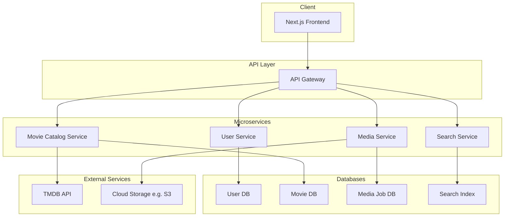

# Infrastructure Plan for Microservices Migration

This document outlines the proposed infrastructure for the new microservices architecture.

## 1. Core Components

### 1.1. Containerization: Docker

Each microservice will be packaged as a lightweight, standalone Docker container. This will ensure consistency across development, testing, and production environments.

### 1.2. Orchestration: Kubernetes

We will use Kubernetes to automate the deployment, scaling, and management of our containerized services. This will provide resilience, and efficient resource utilization.

### 1.3. API Gateway

An API Gateway will serve as the single entry point for all client requests. It will route traffic to the appropriate microservice and can be extended to handle cross-cutting concerns like authentication, rate limiting, and logging.

### 1.4. Database Strategy

Each microservice will have its own dedicated database to ensure loose coupling. The choice of database technology (e.g., PostgreSQL, MongoDB) will be tailored to the specific needs of each service.

## 2. High-Level Architecture Diagram

The following diagram illustrates the new architecture:

---
