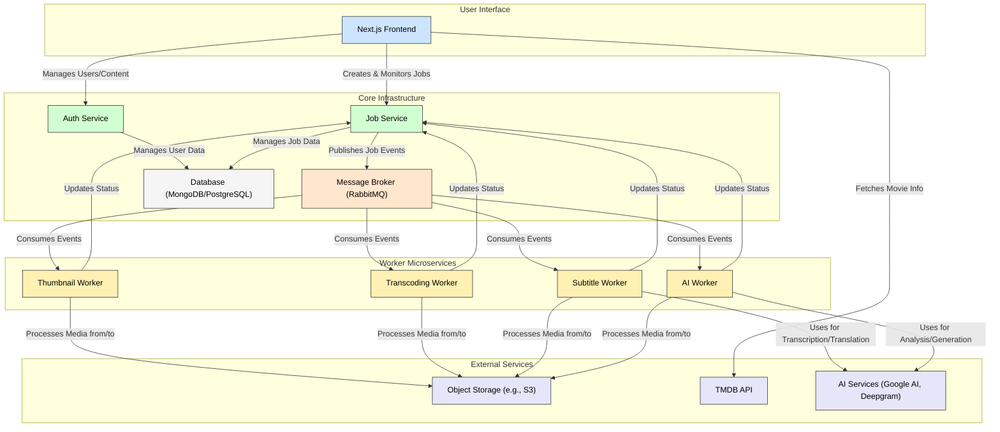
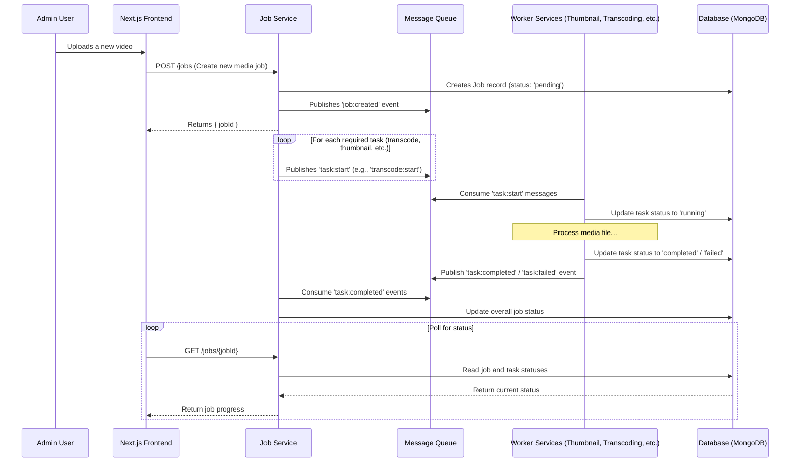

# 🎬 Media Microservices Platform

[](https://opensource.org/licenses/ISC)
[](https://www.typescriptlang.org/)
[](https://nextjs.org/)
[](https://nodejs.org/)
[](https://www.docker.com/)
[](https://www.rabbitmq.com/)
[](https://www.mongodb.com/)
[](https://redis.io/)
[](https://www.postgresql.org/)

This project is a scalable, production-ready, microservice-based media platform built with a clean architecture. It was migrated from a monolithic Next.js application to a distributed system to handle complex media processing tasks like transcoding, thumbnail generation, AI analysis, and subtitle creation asynchronously.

---

## 🏛️ High-Level Architecture

The system is designed around a set of decoupled microservices that communicate asynchronously via a message broker (RabbitMQ). A Next.js frontend acts as the user interface and API gateway, delegating tasks to the appropriate backend services.



---

## ✨ Core Principles & Features

### Clean Architecture

Each microservice is built following the principles of **Clean Architecture**. This ensures a clear separation of concerns, making the system highly maintainable, testable, and independent of frameworks and external dependencies.

- **Domain Layer**: Contains core business entities and rules.
- **Application Layer**: Orchestrates the flow of data using use cases and defines interfaces (ports).
- **Infrastructure Layer**: Implements the interfaces defined in the application layer (e.g., database repositories, message queue adapters).
- **Presentation Layer**: The entry point of the service (e.g., API controllers, message consumers).

### Key Features

- **Asynchronous Media Processing**: A robust pipeline for handling complex media tasks in the background without blocking the UI.
- **Advanced AI Capabilities**:
  - **AI Poster & Backdrop Generation**: Automatically creates stunning posters and backdrops for movies using generative AI.
  - **AI Voice Dubbing**: Generates dubbed audio tracks in multiple languages using advanced text-to-speech synthesis.
  - **AI Chapter & Subtitle Generation**: Analyzes video content to automatically generate chapter markers and transcribe audio for subtitles.
- **Comprehensive User Management**: The admin panel provides full CRUD (Create, Read, Update, Delete) functionality for user management, including role-based access control (RBAC).
- **Adaptive Video Streaming**: Videos are transcoded into multiple resolutions (240p to 1080p) and served using DASH for an optimal viewing experience on any device and network condition.

---

## 🔄 Asynchronous Media Processing Workflow

The media processing pipeline is orchestrated by the `job-service`, which communicates with specialized worker microservices via a message queue. This decoupled architecture allows for scalability and resilience.



---

## 🔐 Authentication & Authorization

User authentication and authorization are handled by the dedicated `auth-service`. It provides a secure, token-based system for managing user access.

- **Registration & Login**: Users can register and log in, receiving a **JWT (JSON Web Token)** upon successful authentication.
- **Token-Based Security**: The JWT is sent with subsequent requests to protected endpoints.
- **Middleware**: The Next.js frontend and other services use middleware to validate the JWT and authorize requests.
- **Role-Based Access Control (RBAC)**: The `auth-service` assigns roles (e.g., `USER`, `ADMIN`) to users, which are encoded in the JWT. This allows different parts of the application, like the admin panel, to restrict access based on user roles.
- **Session Management**: The service uses Redis for caching sessions, enabling features like token refreshing and secure logout.

---

## 📦 Monorepo Structure

The project is organized as a monorepo using `pnpm` workspaces and `Turborepo` to manage dependencies and build processes efficiently.

```
/
├── apps/
│   └── frontend/      # Next.js application (UI and Admin Panel)
├── packages/
│   ├── core/          # Shared interfaces, entities, and utilities
│   ├── database/      # Shared database connection logic
│   ├── logger/        # Centralized logging solution
│   └── message-queue/ # Shared message queue adapter
├── services/
│   ├── auth-service/
│   ├── job-service/
│   ├── ai-worker/
│   ├── subtitle-worker/
│   ├── thumbnail-worker/
│   └── transcoding-worker/
├── docker-compose.yml
├── package.json
└── pnpm-workspace.yaml
```

---

## 🛠️ Services & Applications

This monorepo contains the following primary applications and services:

| Service / App                     | Description                                                                                                                    | Technologies                                                     |
| :-------------------------------- | :----------------------------------------------------------------------------------------------------------------------------- | :--------------------------------------------------------------- |
| **`apps/frontend`**               | The main Next.js application serving the public user interface for browsing movies and the admin panel for content management. | Next.js, React, TypeScript, Tailwind CSS, Shadcn UI, NextAuth.js |
| **`services/auth-service`**       | Manages user authentication, authorization, registration, and JWT-based session management.                                    | Node.js, TypeScript, Express, PostgreSQL, Prisma, Redis, JWT     |
| **`services/job-service`**        | A central hub for creating, tracking, and dispatching asynchronous jobs to the various worker services via the message queue.  | Node.js, TypeScript, Express, MongoDB, RabbitMQ                  |
| **`services/ai-worker`**          | Handles all AI-related tasks, including generating image prompts, creating dubbed audio tracks, and analyzing video content.   | Node.js, TypeScript, Google Genkit, Google Cloud TTS, FFmpeg     |
| **`services/subtitle-worker`**    | Responsible for generating subtitles by transcribing audio (via Deepgram) and translating the text (via Google Translate).     | Node.js, TypeScript, Deepgram SDK, Google Translate, FFmpeg      |
| **`services/thumbnail-worker`**   | Generates video thumbnails and a corresponding WebVTT file for scrubbable previews on the video player.                        | Node.js, TypeScript, FFmpeg                                      |
| **`services/transcoding-worker`** | Transcodes uploaded videos into multiple resolutions for adaptive streaming (DASH/HLS) and integrates dubbed audio tracks.     | Node.js, TypeScript, FFmpeg                                      |

---

## 🚀 Getting Started

Follow these steps to set up and run the project locally for development.

### Prerequisites

- **Node.js** (v20 or later)
- **pnpm**: `npm install -g pnpm`
- **Docker** & **Docker Compose**

### 1. Clone the Repository

```bash
git clone <your-repository-url>
cd <repository-name>
```

### 2. Install Dependencies

Install all dependencies for the monorepo from the root directory.

```bash
pnpm install
```

### 3. Set Up Environment Variables

Each service and application in the monorepo has its own `.env.example` file. Copy these to `.env` files and populate them with your local configuration (database URLs, API keys, etc.).

- `apps/frontend/.env.example`
- `services/auth-service/.env.example`
- `services/job-service/.env.example`
- etc.

### 4. Run Supporting Infrastructure

Start the required backing services (databases, message queue) using Docker Compose.

```bash
docker-compose up -d
```

This will start containers for PostgreSQL, MongoDB, and RabbitMQ as defined in `docker-compose.yml`.

### 5. Run Database Migrations

The `auth-service` uses Prisma for database management. Run the migrations to set up the schema.

```bash
pnpm --filter auth-service prisma:migrate
```

### 6. Run the Entire Stack

You can run all services and the frontend application in development mode using Turborepo from the root directory.

```bash
pnpm run dev
```

This command will start each service and the frontend, typically with hot-reloading enabled. You can then access the frontend at `http://localhost:3000`.

---

## 📸 Screenshots & Videos

_(This section is a placeholder. You can add your project's screenshots and video demos here.)_

### Admin Dashboard

<!--  -->

_Figure 1: The admin dashboard provides an overview of users and movies._

### Movie Management

<!--  -->

_Figure 2: The movie management interface allows for uploading, editing, and AI-powered enhancements._

### Video Player

<!--  -->

_Figure 3: The video player with adaptive streaming, multi-language subtitles, and chapter navigation._

---

## 📜 License

This project is licensed under the ISC License. See the [LICENSE](LICENSE) file for details.
