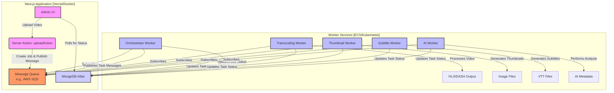

# Detailed Scalability Plan

This document provides a detailed, actionable plan to re-architect the Next.js movie search application for scalability, focusing on the media processing pipeline. This plan expands upon the existing `PRODUCTION_PLAN.md`.

## Proposed Architecture

The core idea is to decouple the monolithic media processing from the main Next.js application. We will introduce a message queue and dedicated worker services to handle these long-running, resource-intensive tasks asynchronously.

## Phase 1: Foundational Setup

This phase prepares the project for a distributed architecture.

### 1.1. Containerize Everything

- **Task:** Create Dockerfiles for all services to ensure consistent environments.
- **Subtasks:**
  - `[ ]` Create a multi-stage `Dockerfile` for the Next.js application.
  - `[ ]` Create a base `Dockerfile` for the future worker services.
  - `[ ]` Create a `docker-compose.yml` file for local development, including the Next.js app, MongoDB, and a message queue service like RabbitMQ.

### 1.2. Implement a CI/CD Pipeline

- **Task:** Automate building and deploying the containerized application.
- **Subtasks:**
  - `[ ]` Set up a GitHub Actions workflow (`.github/workflows/main.yml`).
  - `[ ]` The workflow should run tests, lint, and build Docker images on every push to `main`.
  - `[ ]` Configure the pipeline to push the built images to a container registry (e.g., AWS ECR, Google Container Registry, or Docker Hub).

## Phase 2: Decouple Media Processing

This is the core phase for achieving scalability.

### 2.1. Introduce a Message Queue

- **Task:** Set up a message broker to handle communication between services.
- **Subtasks:**
  - `[ ]` Choose and provision a message queue service. **Recommendation:** AWS SQS for its scalability and managed nature.
  - `[ ]` Define the message schemas (e.g., using JSON schema or TypeScript types) for jobs like `video.uploaded`, `video.transcode`, `video.generate_thumbnails`, etc.
  - `[ ]` Create a utility library (`src/lib/queue`) to abstract publishing and subscribing to messages.

### 2.2. Refactor the Main Application

- **Task:** Modify the Next.js app to dispatch jobs to the queue instead of processing them synchronously.
- **Subtasks:**
  - `[ ]` Refactor the `uploadAction` in [`src/app/(admin)/admin/movies/_action.tsx:229`](<src/app/(admin)/admin/movies/_action.tsx:229>).
    - It should now only handle the file upload to a temporary storage (like S3).
    - After upload, it should create a `MediaProcessingJob` in MongoDB with a "pending" status.
    - Finally, it should publish a `video.uploaded` message to the queue with the job ID and file location.
  - `[ ]` The frontend UI for polling job status in [`src/app/(admin)/admin/movies/movies-table.tsx:239`](<src/app/(admin)/admin/movies/movies-table.tsx:239>) and [`src/app/(admin)/admin/movies/[id]/edit-movie.tsx:249`](<src/app/(admin)/admin/movies/[id]/edit-movie.tsx:249>) will remain largely the same, as it already checks the database.

### 2.3. Create Dedicated Worker Services

- **Task:** Create independent, containerized services for each media processing task. These will live in a new `services/` or `workers/` directory.
- **Subtasks:**
  - `[ ]` **Create an Orchestrator Worker:**
    - This worker subscribes to `video.uploaded` messages.
    - It will contain the logic from [`src/lib/media/media-manager.ts:569`](src/lib/media/media-manager.ts:569) to determine the processing steps.
    - It will publish individual task messages (e.g., `video.transcode`, `video.generate_thumbnails`) to the queue.
  - `[ ]` **Create a Transcoding Worker:**
    - Subscribes to `video.transcode` messages.
    - Contains the core logic from [`src/lib/media/engines/transcoding-engine.ts:589`](src/lib/media/engines/transcoding-engine.ts:589).
    - On completion/failure, it updates the corresponding task status in the `MediaProcessingJob` collection in MongoDB.
  - `[ ]` **Create a Thumbnail Worker:**
    - Subscribes to `video.generate_thumbnails` messages.
    - Contains the core logic from [`src/lib/media/engines/thumbnail-engine.ts:583`](src/lib/media/engines/thumbnail-engine.ts:583).
    - Updates its task status in MongoDB.
  - `[ ]` **Create a Subtitle Worker:**
    - Subscribes to `video.generate_subtitles` messages.
    - Contains the core logic from [`src/lib/media/engines/subtitle.ts:578`](src/lib/media/engines/subtitle.ts:578).
    - Updates its task status in MongoDB.
  - `[ ]` **Create an AI Worker:**
    - Subscribes to `video.ai_analysis` messages.
    - Contains the core logic from [`src/lib/media/engines/ai-engine.ts:573`](src/lib/media/engines/ai-engine.ts:573).
    - Updates its task status in MongoDB.

## Phase 3: Optimization and Monitoring

### 3.1. Implement Monitoring and Alerting

- **Task:** Gain visibility into the new distributed system.
- **Subtasks:**
  - `[ ]` Integrate a monitoring platform (e.g., Datadog, Prometheus/Grafana).
  - `[ ]` Create dashboards to track:
    - Queue length and message age.
    - Worker utilization (CPU/Memory).
    - Job completion rates and error rates.
  - `[ ]` Set up alerts for critical events (e.g., queue length > threshold, high worker failure rate).

### 3.2. Optimize Data Storage and Access

- **Task:** Ensure data layers can handle the load.
- **Subtasks:**
  - `[ ]` Use a cloud-based object storage like **AWS S3** for all media files (uploads, transcoded outputs, thumbnails). The current file system storage won't work in a distributed environment.
  - `[ ]` Refactor file paths in the application to use S3 URLs. The API route [`src/app/api/static/[...file]/route.ts:363`](src/app/api/static/[...file]/route.ts:363) will need to be re-evaluated; serving large files through Next.js is not scalable. It's better to serve them directly from S3 or via a CDN.
  - `[ ]` Implement a distributed caching layer with **Redis** for TMDB API calls and other frequently accessed data, replacing the in-memory `next/cache` in [`src/server/tmdb.ts:599`](src/server/tmdb.ts:599).
