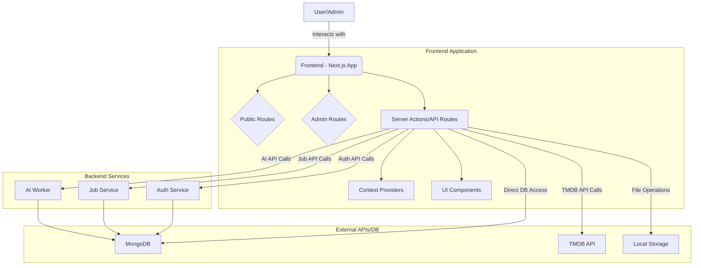

# Frontend Application

This document provides a comprehensive overview of the `apps/frontend` application, a Next.js project designed to serve both public-facing content and an administrative panel. It integrates with various backend services for authentication, job processing, and AI-driven media functionalities.

## Table of Contents

- [Features](#features)
- [Technologies Used](#technologies-used)
- [Architecture](#architecture)
  - [High-Level Overview](#high-level-overview)
  - [Data Flow](#data-flow)
  - [Diagram](#diagram)
- [Environment Variables](#environment-variables)
- [Dependencies](#dependencies)
- [Scripts](#scripts)
- [Styling](#styling)
- [Database Connection](#database-connection)
- [UI Components](#ui-components)
- [AI/Media Processing Integration](#aimedia-processing-integration)

## Features

The frontend application provides the following key features:

- **Public-facing Movie/Series Browsing:** Users can explore a vast library of movies and series, view details, and stream content. This includes searching for movies using the TMDB API.
- **User Authentication:** Secure sign-up, sign-in, and session management powered by NextAuth.js, ensuring a personalized and protected user experience.
- **Admin Panel:** A dedicated section for administrators to manage various aspects of the application.
  - **User Management:** Comprehensive tools to view, create, update, and delete user accounts, including role assignment and permission management.
  - **Movie/Series Management:** Functionality to upload new movies/series, edit existing metadata, manage associated media files, and delete content.
  - **Media Processing Status Tracking:** Monitor the progress and status of media processing jobs, such as video transcoding, thumbnail generation, and subtitle creation.
  - **AI-driven Media Features:** Leverage AI for advanced media operations, including automatic image generation for movie posters, intelligent content suggestions, and media analysis.
- **Dynamic Content Serving:** Static file serving for media assets.
- **Responsive Design:** Optimized for various screen sizes.
- **Theming:** Light/Dark mode support.

## Technologies Used

The `apps/frontend` project leverages a modern web development stack:

| Category           | Technology/Tool                              | Description                                                                   |
| :----------------- | :------------------------------------------- | :---------------------------------------------------------------------------- |
| **Framework**      | Next.js (React)                              | Full-stack React framework for building web applications.                     |
| **Language**       | TypeScript                                   | Statically typed superset of JavaScript.                                      |
| **Styling**        | Tailwind CSS, PostCSS, SASS                  | Utility-first CSS framework, CSS post-processor, and CSS pre-processor.       |
| **UI Components**  | Shadcn UI, Material UI, Radix UI             | Reusable UI components for a consistent design system.                        |
| **State Mgmt.**    | React Context API, React Hooks               | Managing application-wide state and component logic.                          |
| **Authentication** | NextAuth.js, JWT                             | Secure authentication and session management.                                 |
| **Database ORM**   | Mongoose (for MongoDB interaction)           | Object Data Modeling (ODM) library for MongoDB.                               |
| **Media Playback** | `@vidstack/react`, `dashjs`                  | Video player components and DASH streaming support.                           |
| **AI Integration** | `@genkit-ai/googleai`, `@genkit-ai/vertexai` | Integration with Google AI and Vertex AI for AI features.                     |
| **Other**          | `fluent-ffmpeg`, `multer`, `uuid`, `zod`     | Multimedia processing, file uploads, unique ID generation, schema validation. |

## Architecture

### High-Level Overview

The `apps/frontend` is a Next.js application structured to separate public-facing routes from administrative functionalities. It utilizes Next.js's App Router, Server Components, and Server Actions for efficient data fetching and mutations.

The application interacts with several external services:

- **Auth Service:** Handles user registration, login, logout, and token refreshing.
- **Job Service:** Manages long-running media processing tasks (e.g., transcoding, thumbnail generation).
- **AI Worker:** Provides AI-driven functionalities like image prompt generation and media analysis.
- **MongoDB:** Stores movie and user data.
- **TMDB API:** Fetches movie metadata.

### Data Flow

1.  **User Interaction:** Users interact with the UI (public or admin).
2.  **Client-side Actions:** React components handle UI logic and trigger data operations.
3.  **Server Actions/API Routes:** For data fetching or mutations, requests are sent to Next.js Server Actions or API routes.
4.  **Backend Service Calls:** Server Actions/API routes communicate with the Auth Service, Job Service, or AI Worker via HTTP requests.
5.  **Database Interaction:** The frontend directly interacts with MongoDB for movie and user data (e.g., via Mongoose in server-side code).
6.  **Media Storage:** Uploaded media files are handled by a local storage adapter.

### Diagram

## Environment Variables

The application relies on the following environment variables, typically defined in `.env.local`:

| Variable Name                  | Description                                                           | Example Value                                               |
| :----------------------------- | :-------------------------------------------------------------------- | :---------------------------------------------------------- |
| `TMDB_API_KEY`                 | API key for The Movie Database.                                       | `YOUR_TMDB_API_KEY`                                         |
| `NEXTAUTH_URL`                 | URL for NextAuth callbacks.                                           | `http://localhost:3000`                                     |
| `NEXTAUTH_SECRET`              | Secret for NextAuth session encryption.                               | `YOUR_NEXTAUTH_SECRET`                                      |
| `MONGODB_URI`                  | Connection string for MongoDB.                                        | `mongodb+srv://<user>:<password>@<cluster>.mongodb.net/...` |
| `FFMPEG_PATH`                  | Path to the FFmpeg executable (used for media processing).            | `/usr/bin/ffmpeg` (example for Linux)                       |
| `DEEPGRAM_API_KEY`             | API key for Deepgram (speech-to-text).                                | `YOUR_DEEPGRAM_API_KEY`                                     |
| `GOOGLE_API_KEY`               | API key for Google services (e.g., Google AI, Vertex AI).             | `YOUR_GOOGLE_API_KEY`                                       |
| `NEXT_PUBLIC_AUTH_SERVICE_URL` | Public URL for the authentication service.                            | `http://localhost:3001/api/v1/auth`                         |
| `NEXT_PUBLIC_USER_SERVICE_URL` | Public URL for the user service.                                      | `http://localhost:3001/api/v1`                              |
| `NEXT_PUBLIC_JOB_SERVICE_URL`  | Public URL for the job processing service.                            | `http://localhost:3002/api`                                 |
| `NEXT_PUBLIC_AI_WORKER_URL`    | Public URL for the AI worker service.                                 | `http://localhost:3005/api`                                 |
| `LOCAL_STORAGE_PATH`           | Relative path for local file storage.                                 | `../../local_storage`                                       |
| `TEMP_OUT_DIR`                 | Relative path for temporary output directory during media processing. | `../../temp`                                                |

## Dependencies

Key dependencies from `package.json`:
