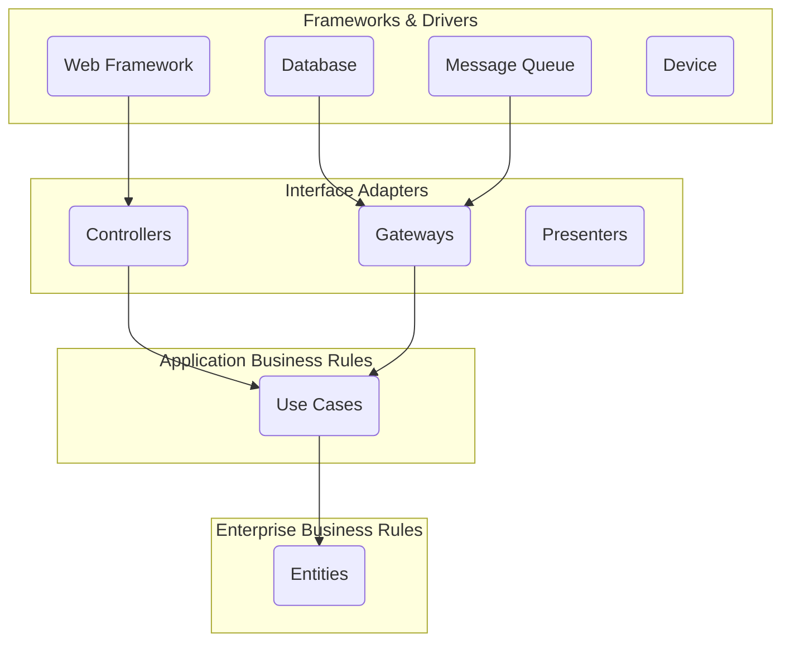
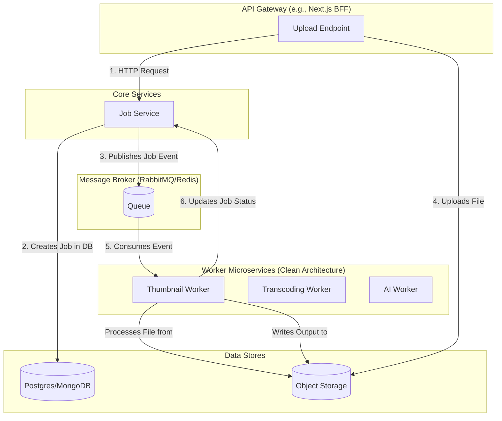

# Detailed Plan: Migrating to a Clean Architecture Microservices System

**Objective:** To refactor the existing monolithic media processing system into a scalable, production-ready, and maintainable microservices architecture. This plan strictly adheres to the principles of **Clean Architecture** to ensure separation of concerns, testability, and independence from frameworks and external agencies.

**Target Audience:** This document is intended for developers and AI models responsible for implementing the architecture. It provides the necessary context, principles, and step-by-step instructions.

---

## 1. Core Concepts: Clean Architecture for Microservices

Each microservice in our system will be a self-contained application that follows the Clean Architecture paradigm. This ensures that our business logic is the core of our system, and all external dependencies (like databases, message queues, and frameworks) are treated as plugins.

### The Dependency Rule

All source code dependencies must point inwards. Nothing in an inner circle can know anything at all about something in an outer circle.



- **Entities (Domain Layer):** Contains the core business objects and rules that are the least likely to change. They are plain objects with no dependencies on any other layer. (e.g., `MediaJob`, `Task`).
- **Use Cases (Application Layer):** Orchestrates the flow of data to and from the entities. It implements application-specific business logic. It defines interfaces (ports) that are implemented by the outer layers.
- **Interface Adapters:** This layer acts as a set of converters. It adapts the data from the format most convenient for the Use Cases and Entities to the format most convenient for external agencies like the Database or the Web. This is where our Repositories (implementations), Message Queue consumers, and API controllers will live.
- **Frameworks & Drivers:** The outermost layer, composed of frameworks and tools like the database, web framework, message queue client, etc. The code in this layer is just a plugin to the rest of the system.

---

## 2. High-Level System Architecture

The overall system will consist of several decoupled services communicating asynchronously via a message queue.



---

## 3. Detailed Phased Implementation Plan

### Phase 1: Building the First Worker (`thumbnail-worker`) with Clean Architecture

**Goal:** Create a fully functional, standalone `thumbnail-worker` microservice that establishes the architectural pattern for all future workers.

**1.1. Project Scaffolding:**
Create the following directory structure inside `services/thumbnail-worker`:

```
services/thumbnail-worker/
├── src/
│   ├── domain/
│   │   ├── entities/       # Business objects (e.g., Job.ts)
│   │   └── repositories/   # Repository INTERFACES (e.g., IJobRepository.ts)
│   ├── application/
│   │   ├── use-cases/      # Application logic (e.g., GenerateThumbnailUseCase.ts)
│   │   └── ports/          # Interfaces for external services (e.g., IQueue.ts, IMediaProcessor.ts)
│   ├── infrastructure/
│   │   ├── persistence/    # Repository IMPLEMENTATIONS (e.g., MongoJobRepository.ts)
│   │   ├── messaging/      # Queue IMPLEMENTATIONS (e.g., RabbitMQAdapter.ts)
│   │   ├── media/          # FFmpeg wrapper IMPLEMENTATION
│   │   └── config/         # Environment variables, etc.
│   └── presentation/
│       └── consumers.ts    # Entry point: Listens to queue and calls use cases
├── package.json
├── tsconfig.json
└── Dockerfile
```

**1.2. Domain Layer (`src/domain`):**

- **`entities/Job.ts`:** Define the `Job` entity with properties like `id`, `mediaId`, `status`, `sourceUrl`, `outputUrl`, `error`. This is a plain class or interface with no external dependencies.
- **`repositories/IJobRepository.ts`:** Define the interface for persistence.
  ```typescript
  interface IJobRepository {
    findById(id: string): Promise<Job | null>;
    update(job: Job): Promise<void>;
  }
  ```

**1.3. Application Layer (`src/application`):**

- **`ports/IMediaProcessor.ts`:** Define the interface for the media processing tool.
  ```typescript
  interface IMediaProcessor {
    generateThumbnail(
      videoUrl: string,
      outputDir: string,
    ): Promise<{ thumbnailUrl: string }>;
  }
  ```
- **`use-cases/GenerateThumbnailUseCase.ts`:** The core logic.

  ```typescript
  // Constructor Injection for dependencies
  constructor(
    private jobRepository: IJobRepository,
    private mediaProcessor: IMediaProcessor
  ) {}

  async execute(jobId: string): Promise<void> {
    const job = await this.jobRepository.findById(jobId);
    // ... handle job not found ...
    try {
      job.status = 'processing';
      await this.jobRepository.update(job);

      const { thumbnailUrl } = await this.mediaProcessor.generateThumbnail(job.sourceUrl, '/tmp/output');

      job.status = 'completed';
      job.outputUrl = thumbnailUrl;
      await this.jobRepository.update(job);
    } catch (error) {
      job.status = 'failed';
      job.error = error.message;
      await this.jobRepository.update(job);
    }
  }
  ```

**1.4. Infrastructure Layer (`src/infrastructure`):**

- **`media/FfmpegProcessor.ts`:** Implement the `IMediaProcessor` interface, wrapping the `fluent-ffmpeg` library. The logic from the old `thumbnail-engine.ts` goes here.
- **`persistence/MongoJobRepository.ts`:** Implement the `IJobRepository` interface using a MongoDB driver (e.g., Mongoose).
- **`messaging/RabbitMQAdapter.ts`:** Implement the logic to connect to RabbitMQ and consume messages.

**1.5. Presentation Layer (`src/presentation`):**

- **`consumers.ts`:** This is the entry point of the service.
  - It will initialize all the infrastructure components (DB connection, message queue adapter).
  - It will instantiate the repository and processor implementations.
  - It will instantiate the use case, injecting the concrete implementations.
  - It will start listening to the queue and, upon receiving a message, call `useCase.execute(jobId)`.

**1.6. Modifying the API Service:**

- The frontend's API route for uploads will be changed to publish a message to the `thumbnail-jobs` queue instead of calling `MediaManager`. The message will contain the `jobId` and other necessary data.

---

### Phase 2: Service Expansion and Shared Packages

**Goal:** Add more workers and abstract common code into shared packages to avoid duplication.

- **2.1. Create Shared Packages:** In the `packages/` directory:
  - **`core`:** Will contain shared domain entities (`BaseJob`) and interfaces (`IRepository`).
  - **`message-queue`:** A wrapper around the message queue client for standardized publishing and subscribing.
  - **`database`:** A package to manage database connections and schemas.
- **2.2. Implement `transcoding-worker`:** Create a new service following the exact same Clean Architecture pattern, reusing code from the shared packages.
- **2.3. Implement `job-service`:** A dedicated service to manage the lifecycle of jobs. It will provide a simple API (REST or gRPC) for creating jobs and retrieving their status. The API Gateway will now communicate with this service.

---

### Phase 3: Production Readiness

**Goal:** Make the system robust, resilient, and deployable.

- **3.1. Sagas for Complex Workflows:** For multi-step processes, use a saga pattern. The `job-service` can act as an orchestrator, listening for events like `thumbnail.completed` and dispatching new commands like `transcode.start`.
- **3.2. Error Handling:** Implement dead-letter queues (DLQs) to handle messages that fail processing repeatedly.
- **3.3. Configuration Management:** Externalize configuration (DB connection strings, queue URLs) and manage them per environment.

---

### Phase 4: Deployment and Observability

**Goal:** Containerize the services and set up monitoring.

- **4.1. Dockerize Everything:** Create a `Dockerfile` for each microservice.
- **4.2. Docker Compose:** Create a `docker-compose.yml` file to orchestrate all services for local development.
- **4.3. Observability:**
  - **Structured Logging:** Implement structured (JSON) logging in all services.
  - **Distributed Tracing:** Use OpenTelemetry to trace requests across service boundaries.
  - **Metrics:** Expose key metrics (e.g., job duration, queue size, error rate) via a Prometheus endpoint.

This detailed plan provides a clear path forward. Are you satisfied with this level of detail to proceed with implementation?
