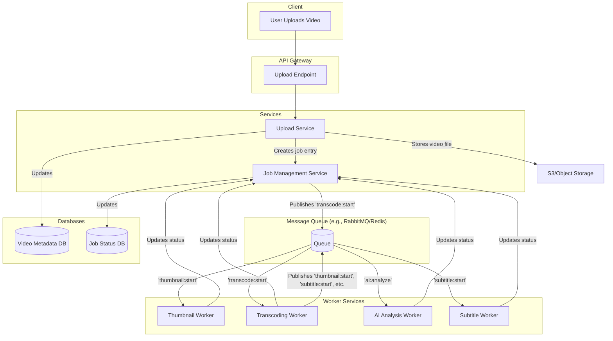

# Media Processing Microservice Architecture Plan

This document outlines the plan to refactor the existing media processing implementation into a scalable and production-ready microservice architecture.

## Current State Analysis

The current implementation is a monolith, tightly coupled with the Next.js frontend. The `MediaManager` orchestrates different `MediaEngine` instances sequentially within the same process. This has several limitations:

- **Scalability:** The processing is limited to the resources of a single server instance.
- **Reliability:** An error in one engine can bring down the entire processing job.
- **Maintainability:** Adding new processing steps or modifying existing ones is complex and risky.

## Proposed Architecture

We will adopt a microservice-based architecture, where each processing step (thumbnailing, transcoding, etc.) is an independent worker service. A message queue will be used to decouple the services and manage the workflow.

## Phased Migration Plan

We will migrate the system in phases to minimize disruption and risk.

### Phase 1: Foundational Microservice Setup (Focus on Thumbnails)

The goal of this phase is to extract the thumbnail generation logic into its own microservice and establish the basic communication infrastructure.

- **1.1: Create Worker Service:**
  - Create a new directory: `services/thumbnail-worker`.
  - Initialize a new Node.js project (`package.json`).

- **1.2: Isolate Thumbnail Logic:**
  - Move the core thumbnail generation logic from `apps/frontend/src/lib/media/engines/thumbnail-engine.ts` to the new worker.
  - Adapt the logic to be a standalone service, removing any frontend-specific dependencies.

- **1.3: Introduce Message Queue:**
  - Set up a message queue (e.g., Redis Streams or RabbitMQ).
  - Implement a message consumer in the `thumbnail-worker` to listen for `thumbnail:start` jobs.

- **1.4: Define Data Contract:**
  - Define a clear and versioned JSON schema for messages in the queue. For a thumbnail job, this would include `mediaId`, `inputFileUrl`, and `outputLocation`.

- **1.5: Update API Service:**
  - Modify the API service. Instead of calling `MediaManager` directly, it will now publish a job to the message queue.

- **1.6: Status Reporting:**
  - The `thumbnail-worker` will update the job status in the database (e.g., `in-progress`, `completed`, `failed`).

### Phase 2: Decoupling and Communication

This phase focuses on building a robust communication layer and preparing for more workers.

- **2.1: Abstract Queue Logic:**
  - Create a shared library (`packages/message-queue`) to handle publishing and subscribing to the queue, so workers don't need to know the specific implementation details.

- **2.2: Create a Job Management Service:**
  - Introduce a `JobService` responsible for creating, tracking, and updating the status of all media processing jobs. This service will be the source of truth for job states.

- **2.3: API Gateway:**
  - All incoming requests will go through an API gateway, which will route them to the appropriate service (e.g., `UploadService`, `JobService`).

### Phase 3: Database and State Management

This phase ensures that the state is managed reliably and is accessible to all services.

- **3.1: Centralized Database:**
  - Use a centralized database (like Postgres or MongoDB) for storing job information and media metadata.
  - Design the database schema to support the distributed nature of the system.

- **3.2: Isolate Database Access:**
  - Create a data access layer (DAL) or use an ORM to abstract database interactions. This will be part of a shared package.

### Phase 4: Containerization and Deployment

The final phase is to prepare the services for production deployment.

- **4.1: Dockerize Services:**
  - Create a `Dockerfile` for each microservice (`thumbnail-worker`, `api-gateway`, etc.).

- **4.2: Orchestration:**
  - Use Docker Compose for local development to spin up all the services.
  - For production, consider a container orchestrator like Kubernetes.

- **4.3: CI/CD:**
  - Set up a CI/CD pipeline to automatically build, test, and deploy the services.

---

This plan provides a high-level overview. We will start with Phase 1 and iterate on the details as we proceed. Are you happy with this plan?
