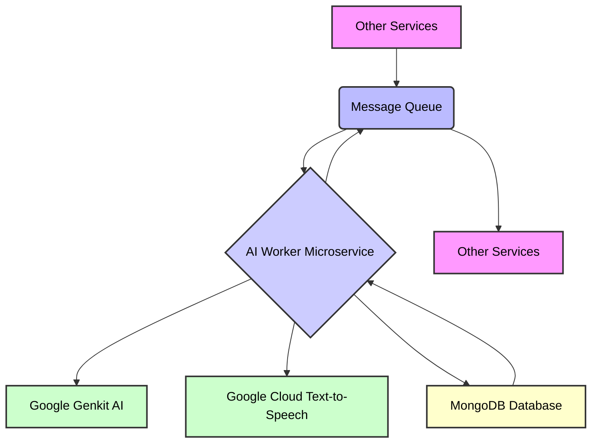

# 🧠 AI Worker Microservice

## Description

The `ai-worker` is a dedicated microservice responsible for handling AI-related tasks within the larger monorepo architecture. It leverages Google's Genkit AI framework and Google Cloud Text-to-Speech for advanced AI functionalities, integrating seamlessly with other services via a message queue and a shared database. This service is designed to be scalable and efficient, processing AI tasks asynchronously.

## Features

- **AI Task Processing**: Executes various AI-related tasks using Google Genkit.
- **Text-to-Speech**: Utilizes Google Cloud Text-to-Speech for generating audio from text.
- **Message Queue Integration**: Communicates with other services through a message queue (AMQP).
- **Database Interaction**: Interacts with a MongoDB database for data persistence.
- **Monorepo Integration**: Part of a larger monorepo, leveraging shared packages like `@monorepo/core`, `@monorepo/database`, `@monorepo/logger`, and `@monorepo/message-queue`.
- **Dockerized Deployment**: Containerized using Docker for consistent and isolated environments.
- **TypeScript**: Developed using TypeScript for type safety and improved code quality.

## Architecture

The `ai-worker` operates as an independent microservice within a larger system. It consumes tasks from a message queue, processes them using its AI capabilities, and stores results in a database.



**Components:**

- **Message Queue (AMQP)**: Used for asynchronous communication and task distribution.
- **Google Genkit AI**: Core AI processing engine.
- **Google Cloud Text-to-Speech**: Provides advanced text-to-speech functionalities.
- **MongoDB**: NoSQL database for storing and retrieving data.
- **Monorepo Packages**: Utilizes shared utilities and interfaces from the monorepo.

## Technologies Used

| Technology                      | Description                                                |
| ------------------------------- | ---------------------------------------------------------- |
| **Node.js**                     | JavaScript runtime environment                             |
| **TypeScript**                  | Superset of JavaScript for type-safe development           |
| **Express.js**                  | Web framework for building APIs                            |
| **Google Genkit AI**            | AI framework for building generative AI applications       |
| **Google Cloud Text-to-Speech** | Cloud-based text-to-speech service                         |
| **AMQPLib**                     | AMQP client for Node.js (message queue)                    |
| **MongoDB**                     | NoSQL database                                             |
| **Fluent-FFmpeg**               | FFmpeg wrapper for media processing                        |
| **Tsyringe**                    | Dependency injection container                             |
| **Zod**                         | TypeScript-first schema declaration and validation library |
| **Docker**                      | Containerization platform                                  |
| **PNPM**                        | Fast, disk space efficient package manager                 |
| **TurboRepo**                   | Monorepo build system                                      |

## Setup and Installation

### Prerequisites

- Docker
- Node.js (v20 or later)
- PNPM

### Local Development

1.  **Clone the monorepo:**
    ```bash
    git clone <your-monorepo-url>
    cd <your-monorepo-name>
    ```
2.  **Install dependencies:**
    ```bash
    pnpm install
    ```
3.  **Build shared packages:**
    ```bash
    pnpm run build:packages
    ```
4.  **Run the `ai-worker` in development mode:**
    ```bash
    pnpm run dev --filter=ai-worker
    ```
    Alternatively, you can use the turbo command directly:
    ```bash
    pnpm run dev:turbo --filter=ai-worker
    ```

### Docker

The `ai-worker` can be built and run using Docker.

1.  **Build the Docker image:**
    ```bash
    docker build -t ai-worker -f services/ai-worker/Dockerfile .
    ```
2.  **Run the Docker container:**
    ```bash
    docker run -p 3000:3000 ai-worker
    ```

### Docker Compose

For a complete local environment including dependencies like MongoDB and RabbitMQ, you can use `docker-compose`.

1.  **Start the services:**
    ```bash
    docker-compose up -d --build ai-worker
    ```
    (Assuming `ai-worker` is defined in your `docker-compose.yml` file)

## Scripts

The following scripts are available in `package.json`:

| Script          | Description                                                                       |
| --------------- | --------------------------------------------------------------------------------- |
| `start`         | Starts the compiled Node.js application.                                          |
| `dev`           | Runs the application in development mode with `nodemon` and `ts-node`.            |
| `dev:turbo`     | Runs the application in development mode using `turbo` for monorepo optimization. |
| `build`         | Compiles TypeScript code and resolves path aliases.                               |
| `docker:dev`    | Builds and starts the Docker container for development using `docker-compose`.    |
| `docker:down`   | Stops and removes Docker containers.                                              |
| `test`          | Runs Jest tests.                                                                  |
| `test:watch`    | Runs Jest tests in watch mode.                                                    |
| `test:coverage` | Runs Jest tests and generates a coverage report.                                  |

## Project Structure

```
services/ai-worker/
├── .dockerignore
├── .eslintrc.js
├── .genkit/             # Genkit related configurations/files
├── .gitignore
├── .turbo/              # TurboRepo cache
├── dist/                # Compiled JavaScript output
├── Dockerfile
├── jest.config.js
├── node_modules/
├── package.json
├── src/                 # Source code
│   └── main.ts          # Main entry point
├── tsconfig.json
└── __test__/            # Test files
```

## Contributing

Please refer to the main monorepo `README.md` for general contributing guidelines.

## License

This project is licensed under the ISC License.
