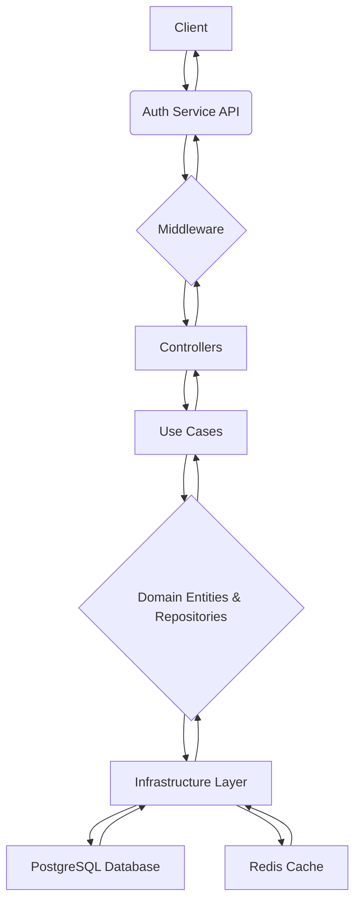

# Auth Service

## Introduction

The Auth Service is a microservice responsible for handling user authentication and authorization within the application. It provides functionalities for user registration, login, token management, and role-based access control.

## Features

- User Registration
- User Login (with JWT token generation)
- User Logout
- Token Refresh
- Role-Based Access Control (RBAC)
- Password Hashing (using bcrypt)
- Session Management (using Redis for caching)

## Architecture

The Auth Service is built using Node.js and TypeScript, following a clean architecture pattern. It leverages Express.js for handling API requests, Prisma as an ORM for database interactions, and tsyringe for dependency injection. Redis is used for caching and session management.



### Key Components:

- **Presentation Layer**: Handles HTTP requests and responses. Contains controllers, routes, and middleware for authentication and authorization.
- **Application Layer**: Contains use cases that orchestrate business logic.
- **Domain Layer**: Defines core business entities (User, UserCredential, Role) and business rules.
- **Infrastructure Layer**: Implements interfaces defined in the application layer, providing concrete implementations for database repositories (Prisma), caching (Redis), and security (bcrypt, JWT).

### Data Flow:

1.  **Request**: A client sends an HTTP request (e.g., login, register) to the Auth Service.
2.  **Routing**: Express.js routes the request to the appropriate controller.
3.  **Validation & Middleware**: Request data is validated, and authorization checks are performed by middleware.
4.  **Use Case Execution**: The controller invokes a use case from the application layer.
5.  **Domain Logic**: The use case interacts with domain entities and repositories to perform business operations.
6.  **Infrastructure Interaction**: Repositories interact with the PostgreSQL database (via Prisma) and Redis cache.
7.  **Response**: The result is returned through the layers back to the client.

## Technologies Used

- **Language**: TypeScript
- **Runtime**: Node.js
- **Web Framework**: Express.js
- **ORM**: Prisma
- **Database**: PostgreSQL
- **Cache/Session Store**: Redis
- **Dependency Injection**: tsyringe
- **Password Hashing**: bcrypt
- **Token Management**: jsonwebtoken
- **Linting**: ESLint
- **Testing**: Jest, Supertest
- **Containerization**: Docker

## Getting Started

### Prerequisites

- Node.js (v20 or higher)
- pnpm
- Docker (for local development with PostgreSQL and Redis)

### Installation

1.  Clone the repository:
    ```bash
    git clone <repository-url>
    cd services/auth-service
    ```
2.  Install dependencies:
    ```bash
    pnpm install
    ```
3.  Set up environment variables:
    Create a `.env` file in the `services/auth-service` directory based on `.env.example`.

4.  Start Docker services (PostgreSQL and Redis):
    ```bash
    docker-compose up -d
    ```
5.  Run Prisma migrations:
    ```bash
    pnpm prisma:migrate
    ```
6.  Generate Prisma client:
    ```bash
    pnpm prisma:generate
    ```

### Running the Service

- **Development Mode**:
  ```bash
  pnpm run dev
  ```
- **Production Build**:
  ```bash
  pnpm run build
  pnpm start
  ```

### Running Tests

- **All Tests**:
  ```bash
  pnpm test
  ```
- **Watch Mode**:
  ```bash
  pnpm test:watch
  ```
- **Coverage Report**:
  ```bash
  pnpm test:coverage
  ```

## API Endpoints

The following are the primary API endpoints exposed by the Auth Service. Detailed documentation, including request/response formats and authentication requirements, will be provided in a separate API reference.

| Method   | Endpoint         | Description                                      |
| -------- | ---------------- | ------------------------------------------------ |
| `POST`   | `/auth/register` | Registers a new user.                            |
| `POST`   | `/auth/login`    | Authenticates a user and issues JWT tokens.      |
| `POST`   | `/auth/refresh`  | Refreshes access tokens using a refresh token.   |
| `POST`   | `/auth/logout`   | Invalidates user sessions and tokens.            |
| `GET`    | `/users/me`      | Retrieves the profile of the authenticated user. |
| `GET`    | `/users/:id`     | Retrieves a user by ID (Admin only).             |
| `PUT`    | `/users/:id`     | Updates a user's profile (Admin only).           |
| `DELETE` | `/users/:id`     | Deletes a user (Admin only).                     |

## Database Schema

### `User` Model

- `id`: String (@id, @default(cuid())) - Unique identifier for the user.
- `name`: String? - User's name (optional).
- `email`: String (@unique) - User's email address, must be unique.
- `createdAt`: DateTime (@default(now())) - Timestamp of user creation.
- `updatedAt`: DateTime (@updatedAt) - Timestamp of last update.
- `credential`: UserCredential? - One-to-one relation with UserCredential.
- `role`: Role (@default(USER)) - User's role (USER or ADMIN).

### `UserCredential` Model

- `id`: String (@id, @default(cuid())) - Unique identifier for the credential.
- `passwordHash`: String - Hashed password of the user.
- `userId`: String (@unique) - Foreign key to the User model, must be unique.
- `user`: User (@relation(fields: [userId], references: [id], onDelete: Cascade)) - Relation to the User model.
- `createdAt`: DateTime (@default(now())) - Timestamp of credential creation.
- `updatedAt`: DateTime (@updatedAt) - Timestamp of last update.

### `Role` Enum

- `USER`
- `ADMIN`
