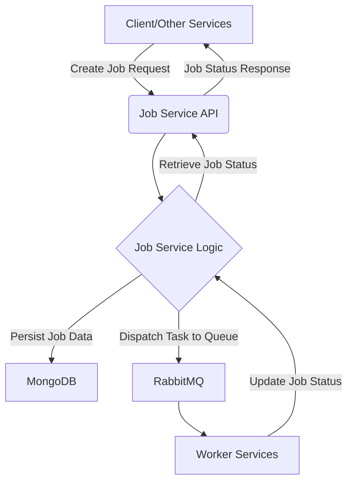

# 🚀 Job Service

The Job Service is a core microservice responsible for managing and processing various asynchronous jobs within the larger application ecosystem. It acts as a central hub for job creation, status tracking, and dispatching tasks to specialized worker services via a message queue.

## ✨ Features

- **Job Creation**: Allows other services to submit new jobs for processing.
- **Job Status Tracking**: Provides endpoints to query the status of ongoing and completed jobs.
- **Message Queue Integration**: Utilizes RabbitMQ for reliable communication with worker services.
- **MongoDB Persistence**: Stores job details and their states in a MongoDB database.
- **Scalable Architecture**: Designed as a microservice to allow independent scaling and deployment.
- **TypeScript**: Ensures type safety and improves code maintainability.
- **Dependency Injection**: Uses `tsyringe` for managing dependencies and promoting testability.

## 🏗️ Architecture

The Job Service operates as a standalone microservice, interacting with a MongoDB database for data persistence and RabbitMQ for inter-service communication.



**Key Components:**

- **Express.js**: Powers the RESTful API for job management.
- **MongoDB**: The primary data store for all job-related information.
- **RabbitMQ**: Facilitates asynchronous communication, enabling reliable task dispatching to various worker services (e.g., AI Worker, Subtitle Worker, Thumbnail Worker, Transcoding Worker).
- **TypeScript**: The primary language for development, ensuring robust and maintainable code.
- **tsyringe**: A powerful dependency injection container used for managing and resolving service dependencies.
- **Zod**: Used for schema validation of incoming requests and data structures.

## 🚀 Getting Started

These instructions will get you a copy of the project up and running on your local machine for development and testing purposes.

### Prerequisites

Before you begin, ensure you have the following installed:

- **Node.js**: (v20 or higher)
- **pnpm**: (v8 or higher) - `npm install -g pnpm`
- **Docker & Docker Compose**: For running MongoDB and RabbitMQ.

### Installation

1.  **Clone the monorepo:**
    ```bash
    git clone <your-monorepo-url>
    cd <your-monorepo-directory>
    ```
2.  **Install dependencies:**
    ```bash
    pnpm install
    ```
3.  **Navigate to the Job Service directory:**
    ```bash
    cd services/job-service
    ```

### Environment Variables

Create a `.env` file in the `services/job-service` directory based on the `.env.example` file:

```bash
cp .env.example .env
```

Edit the `.env` file with your specific configurations.

| Variable       | Description                                          | Default Value (from .env.example)   |
| :------------- | :--------------------------------------------------- | :---------------------------------- |
| `NODE_ENV`     | Environment mode (e.g., `development`, `production`) | `development`                       |
| `PORT`         | Port on which the service will run                   | `3002`                              |
| `MONGO_URI`    | MongoDB connection URI                               | `mongodb://mongo:27017/job-service` |
| `RABBITMQ_URL` | RabbitMQ connection URL                              | `amqp://rabbitmq`                   |
| `CORS_ORIGIN`  | Allowed CORS origin                                  | `http://localhost:3000`             |

### Running the Service

#### Development Mode

To run the service in development mode with hot-reloading:

```bash
pnpm dev
```

Or, if running within the monorepo context using `turbo`:

```bash
pnpm dev:turbo
```

#### Production Mode

First, build the service:

```bash
pnpm build
```

Then, start the service:

```bash
pnpm start
```

#### Running with Docker Compose (Development)

For a full development environment including MongoDB and RabbitMQ:

```bash
pnpm docker:dev
```

To stop the Docker Compose services:

```bash
pnpm docker:down
```

## ⚙️ Scripts

The following scripts are available in `package.json`:

| Script          | Description                                                                                   |
| :-------------- | :-------------------------------------------------------------------------------------------- |
| `start`         | Starts the compiled Node.js application (production).                                         |
| `dev`           | Runs the service in development mode with `nodemon` and `ts-node`.                            |
| `dev:turbo`     | Runs the service in development mode using `turbo` (monorepo context).                        |
| `build`         | Compiles TypeScript code to JavaScript and resolves `tsc-alias`.                              |
| `docker:dev`    | Builds and runs the service along with its dependencies using Docker Compose for development. |
| `docker:down`   | Stops and removes containers, networks, and volumes created by `docker:dev`.                  |
| `test`          | Runs all Jest tests.                                                                          |
| `test:watch`    | Runs Jest tests in watch mode.                                                                |
| `test:coverage` | Runs Jest tests and generates a coverage report.                                              |

## 🧪 Testing

To run the test suite:

```bash
pnpm test
```

For continuous testing during development:

```bash
pnpm test:watch
```

To generate a test coverage report:

```bash
pnpm test:coverage
```

## 🐳 Docker

The `Dockerfile` provides a multi-stage build process for creating efficient Docker images for the Job Service.

- **`base`**: Sets up the base Node.js environment and installs global tools like `pnpm` and `turbo`.
- **`dev`**: Used for local development with hot-reloading.
- **`builder`**: Creates a production-ready build of the application.
- **`prod`**: The final, lean production image containing only the necessary runtime code.

To build the production Docker image:

```bash
docker build -t job-service:latest -f services/job-service/Dockerfile .
```

To run the production Docker image:

```bash
docker run -p 3002:3002 job-service:latest
```

## 📦 Monorepo Integration

This service is part of a larger monorepo managed by `turbo`. It leverages shared packages such as `@monorepo/core`, `@monorepo/database`, `@monorepo/logger`, `@monorepo/message-queue`, and `@monorepo/workers` to promote code reuse and maintain consistency across services.

## 🤝 Dependencies

Key dependencies and their roles:

| Dependency                | Role                                                        |
| :------------------------ | :---------------------------------------------------------- |
| `express`                 | Fast, unopinionated, minimalist web framework for Node.js.  |
| `mongodb`                 | Official MongoDB driver for Node.js.                        |
| `amqplib`                 | AMQP 0-9-1 client for Node.js (used for RabbitMQ).          |
| `dotenv`                  | Loads environment variables from a `.env` file.             |
| `tsyringe`                | Lightweight dependency injection container for TypeScript.  |
| `zod`                     | TypeScript-first schema declaration and validation library. |
| `@monorepo/core`          | Shared core utilities and interfaces across the monorepo.   |
| `@monorepo/database`      | Shared database utilities and configurations.               |
| `@monorepo/logger`        | Centralized logging solution for the monorepo.              |
| `@monorepo/message-queue` | Abstraction layer for message queue interactions.           |
| `@monorepo/workers`       | Shared worker-related utilities and definitions.            |
