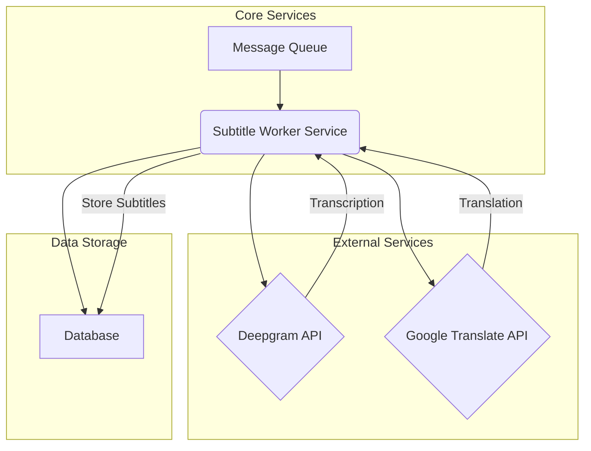

# 🎬 Subtitle Worker Service

## Description

The `subtitle-worker` is a microservice responsible for generating and translating subtitles for media content. It integrates with external APIs for speech-to-text transcription and language translation, processing tasks asynchronously via a message queue.

## Features

- **Speech-to-Text Transcription:** Utilizes Deepgram API to convert audio from media files into text.
- **Language Translation:** Integrates with Google Cloud Translate to translate generated subtitles into various languages.
- **Asynchronous Processing:** Leverages a message queue (RabbitMQ) for efficient, non-blocking task execution.
- **Monorepo Integration:** Part of a larger monorepo, sharing common utilities and configurations.
- **Dockerized:** Easily deployable as a Docker container.

## Technologies Used

The service is built using modern technologies and tools:

| Category                 | Technology/Tool        | Description                                             |
| :----------------------- | :--------------------- | :------------------------------------------------------ |
| **Language**             | TypeScript             | Statically typed superset of JavaScript.                |
| **Runtime**              | Node.js                | JavaScript runtime for server-side execution.           |
| **Package Manager**      | pnpm                   | Fast, disk space efficient package manager.             |
| **Monorepo Tool**        | TurboRepo              | High-performance build system for monorepos.            |
| **Containerization**     | Docker                 | For packaging and deploying the service.                |
| **Testing**              | Jest, ts-jest          | JavaScript testing framework with TypeScript support.   |
| **Linting/Formatting**   | ESLint, Prettier       | Code quality and style enforcement.                     |
| **Transcription**        | Deepgram SDK           | API client for speech-to-text services.                 |
| **Translation**          | Google Cloud Translate | API for language translation.                           |
| **Message Queue**        | amqplib (RabbitMQ)     | AMQP client for message queuing.                        |
| **Database**             | MongoDB                | NoSQL database (inferred from `@types/mongodb`).        |
| **Media Processing**     | fluent-ffmpeg, FFmpeg  | For audio/video processing (e.g., audio extraction).    |
| **Dependency Injection** | tsyringe               | Lightweight dependency injection container.             |
| **Schema Validation**    | Zod                    | TypeScript-first schema declaration and validation.     |
| **Development**          | Nodemon, ts-node       | Live-reloading and TypeScript execution in development. |

## Architecture

The `subtitle-worker` operates as a microservice within a larger ecosystem. It listens for tasks on a message queue, processes them, and interacts with external APIs and a database.



**Flow:**

1.  A new task (e.g., "generate subtitles for video X") is published to the **Message Queue**.
2.  The **Subtitle Worker Service** consumes the task from the queue.
3.  It extracts audio from the media (potentially using FFmpeg) and sends it to the **Deepgram API** for transcription.
4.  The transcribed text is then sent to the **Google Translate API** for translation into target languages.
5.  The generated and translated subtitles are stored in the **Database**.
6.  Status updates or results might be published back to the Message Queue.

## Getting Started

### Prerequisites

- Node.js (v20 or higher)
- pnpm
- Docker (for containerized development/deployment)
- Access to Deepgram API and Google Cloud Translate API (with necessary credentials)
- A running RabbitMQ instance
- A running MongoDB instance

### Installation

1.  Clone the monorepo:
    ```bash
    git clone <your-monorepo-url>
    cd <your-monorepo-directory>
    ```
2.  Install dependencies for the entire monorepo:
    ```bash
    pnpm install
    ```
3.  Navigate to the `subtitle-worker` service directory:
    ```bash
    cd services/subtitle-worker
    ```

### Running Locally (Development)

To run the service in development mode with live-reloading:

```bash
pnpm run dev
```

Or, if using TurboRepo for monorepo development:

```bash
pnpm run dev:turbo
```

### Docker

The service can be built and run using Docker.

**Build and run with Docker Compose (development):**

```bash
docker-compose up -d --build
```

This will build the `dev` stage of the Dockerfile and run the service.

**Stop Docker containers:**

```bash
docker-compose down
```

## Scripts

The `package.json` defines several useful scripts:

| Script          | Description                                                                |
| :-------------- | :------------------------------------------------------------------------- |
| `start`         | Starts the compiled Node.js application.                                   |
| `dev`           | Runs the service in development mode with `nodemon` and `ts-node`.         |
| `dev:turbo`     | Runs the service in development mode using TurboRepo's filtering.          |
| `build`         | Compiles TypeScript code to JavaScript and resolves path aliases.          |
| `docker:dev`    | Builds and runs the Docker container for development using Docker Compose. |
| `docker:down`   | Stops and removes Docker containers defined in `docker-compose.yml`.       |
| `test`          | Runs all tests using Jest.                                                 |
| `test:watch`    | Runs tests in watch mode.                                                  |
| `test:coverage` | Runs tests and generates a code coverage report.                           |

## Testing

Tests are written using Jest and TypeScript.

- Run all tests: `pnpm test`
- Run tests in watch mode: `pnpm test:watch`
- Generate coverage report: `pnpm test:coverage`

## Configuration

Configuration details (e.g., API keys, database connection strings, message queue URLs) are typically managed through environment variables. Refer to the `src/config` directory for specific configuration loading mechanisms.

## Monorepo Structure

This service is part of a larger monorepo. It utilizes shared packages located in the `packages/` directory, such as:

- `@monorepo/core`
- `@monorepo/database`
- `@monorepo/logger`
- `@monorepo/message-queue`
- `@monorepo/workers`
