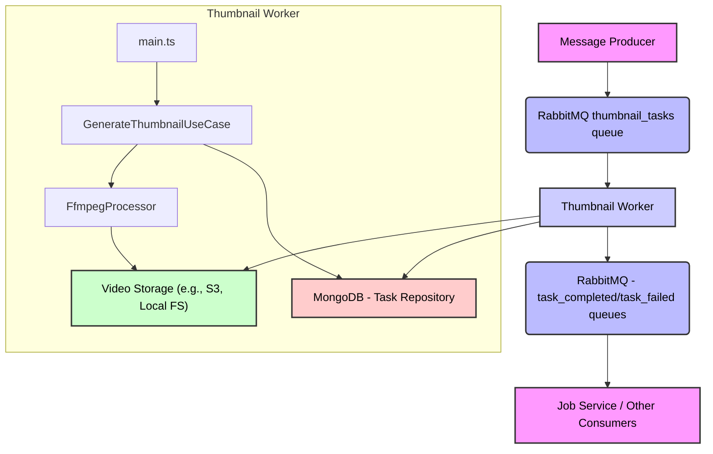

# Thumbnail Worker Microservice

## Description

The `thumbnail-worker` is a microservice responsible for generating video thumbnails and associated VTT (WebVTT) files. It processes messages from a message queue (RabbitMQ) containing video processing tasks, utilizes `ffmpeg` to extract thumbnails, and stores them along with a VTT file for efficient display in video players. This service is part of a larger monorepo architecture.

## Features

- **Thumbnail Generation**: Extracts still images from video files at specified intervals.
- **VTT File Creation**: Generates WebVTT files that map thumbnail images to specific timestamps in the video, enabling interactive scrubbable previews.
- **Message Queue Integration**: Consumes tasks from a RabbitMQ queue and publishes completion/failure messages.
- **Dependency Injection**: Uses `tsyringe` for managing dependencies.
- **Dockerized**: Can be easily deployed using Docker.
- **Monorepo Integration**: Leverages shared packages from the monorepo for database connection, logging, and message queue functionalities.

## Architecture

The `thumbnail-worker` operates within a microservices architecture, interacting with other components primarily through a message queue.



**Flow:**

1.  A **Message Producer** (e.g., a Job Service) sends a `thumbnail_tasks` message to RabbitMQ, containing `jobId`, `taskId`, and `sourceUrl` of the video.
2.  The **Thumbnail Worker** consumes this message.
3.  It resolves the `GenerateThumbnailUseCase` via dependency injection.
4.  The `GenerateThumbnailUseCase` uses the `FfmpegProcessor` to:
    - Download the video from `sourceUrl`.
    - Determine video duration.
    - Generate thumbnails at regular intervals.
    - Create a WebVTT file linking timestamps to thumbnails.
    - Store the generated thumbnails and VTT file in the designated **Video Storage**.
5.  The worker updates the task status in the **MongoDB Task Repository**.
6.  Upon successful completion or failure, the worker publishes a `task_completed` or `task_failed` message back to RabbitMQ.
7.  Other services, like the **Job Service**, can consume these messages to update job statuses or trigger subsequent actions.

## Technologies

The following key technologies are used in this microservice:

| Technology          | Description                                                                           |
| :------------------ | :------------------------------------------------------------------------------------ |
| **TypeScript**      | Primary language for development, providing type safety and scalability.              |
| **Node.js**         | Runtime environment for executing JavaScript code server-side.                        |
| **FFmpeg**          | Powerful multimedia framework used for video processing and thumbnail generation.     |
| **RabbitMQ**        | Message broker for asynchronous communication between microservices.                  |
| **MongoDB**         | NoSQL database used for storing task and job metadata.                                |
| **tsyringe**        | Lightweight dependency injection container for TypeScript.                            |
| **Zod**             | TypeScript-first schema declaration and validation library for environment variables. |
| **Jest**            | JavaScript testing framework for unit and integration tests.                          |
| **ESLint/Prettier** | Code linting and formatting to maintain code quality and consistency.                 |
| **Docker**          | Containerization platform for packaging and deploying the service.                    |
| **TurboRepo**       | Monorepo tool for managing builds and dependencies across multiple packages.          |

## Setup

### Prerequisites

- Node.js (v20 or later)
- pnpm
- Docker
- RabbitMQ instance
- MongoDB instance

### Environment Variables

Create a `.env` file in the `services/thumbnail-worker` directory based on the `config/index.ts` schema:

```
NODE_ENV=development
RABBITMQ_URL=amqp://localhost:5672
MONGO_URL=mongodb://localhost:27017/your-database-name
TEMP_OUT_DIR=/tmp/output
```

### Installation

From the monorepo root:

```bash
pnpm install
```

### Running Locally

1.  **Build the service:**
    ```bash
    pnpm build --filter=thumbnail-worker
    ```
2.  **Start the service:**
    ```bash
    pnpm dev --filter=thumbnail-worker
    ```
    (This uses `nodemon` for hot-reloading during development.)

## Configuration

The service's configuration is managed through environment variables, validated by `Zod`.
See [`src/config/index.ts`](services/thumbnail-worker/src/config/index.ts) for the schema.

## Scripts

The `package.json` defines several utility scripts:

| Script          | Description                                                              |
| :-------------- | :----------------------------------------------------------------------- |
| `start`         | Starts the compiled service in production mode.                          |
| `dev`           | Starts the service in development mode with `nodemon` for hot-reloading. |
| `dev:turbo`     | Runs the `dev` script via `turbo` (monorepo context).                    |
| `build`         | Compiles TypeScript code and aliases paths.                              |
| `docker:dev`    | Builds and starts the service using `docker-compose` for development.    |
| `docker:down`   | Stops and removes Docker containers.                                     |
| `test`          | Runs all tests using Jest.                                               |
| `test:watch`    | Runs tests in watch mode.                                                |
| `test:coverage` | Runs tests and generates a coverage report.                              |

## Testing

Tests are written using `Jest` and `ts-jest`.

To run all tests:

```bash
pnpm test --filter=thumbnail-worker
```

For watch mode:

```bash
pnpm test:watch --filter=thumbnail-worker
```

For coverage report:

```bash
pnpm test:coverage --filter=thumbnail-worker
```

## Docker

The `Dockerfile` defines a multi-stage build process for the `thumbnail-worker`.

### Build Stages

- **`base`**: Sets up Node.js environment, installs `ffmpeg`, `pnpm`, and `turbo`.
- **`dev`**: (Development only) Copies source, installs dependencies, builds packages, and sets up `nodemon` for development.
- **`builder`**: (Production build) Copies source, installs dependencies, builds the worker, and prunes development dependencies.
- **`prod`**: (Production image) Copies the built application from the `builder` stage and sets the production start command.

### Building and Running with Docker

To build the Docker image:

```bash
docker build -t thumbnail-worker:latest -f services/thumbnail-worker/Dockerfile .
```

To run the Docker container (ensure environment variables are passed):

```bash
docker run -d --name thumbnail-worker -e RABBITMQ_URL=... -e MONGO_URL=... thumbnail-worker:latest
```

For development with `docker-compose`:

```bash
pnpm docker:dev --filter=thumbnail-worker
```

## Monorepo Context

This service is part of a larger monorepo. It utilizes shared packages:

- `@monorepo/core`: Provides core interfaces and utilities (e.g., `DI_TOKENS`, `IMediaProcessor`).
- `@monorepo/database`: Handles database connections (e.g., `MongoDbConnection`).
- `@monorepo/logger`: Provides a standardized logging solution (e.g., `WinstonLogger`).
- `@monorepo/message-queue`: Offers message queue abstractions (e.g., `RabbitMQAdapter`).
- `@monorepo/workers`: Defines common worker-related types (e.g., `ThumbnailOutput`, `WorkerOutput`).

These packages are referenced using `workspace:*` in `package.json` and managed by `pnpm` and `turbo`.
