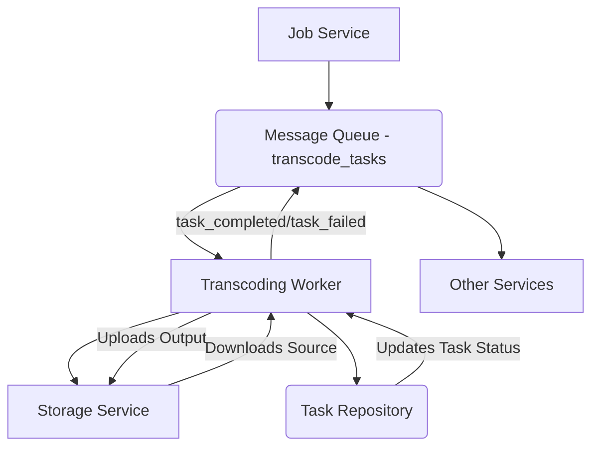
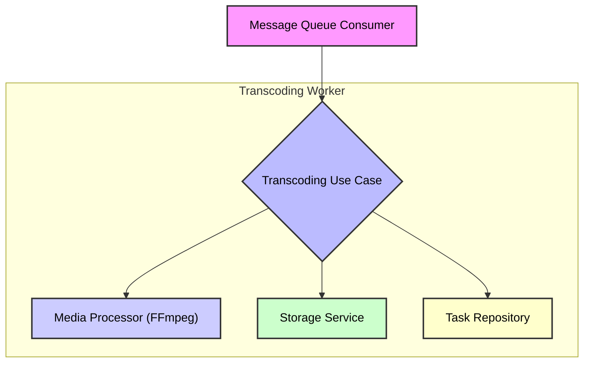

# 🎬 Transcoding Worker Service

## Overview

The `transcoding-worker` is a microservice responsible for processing and transforming media files. It consumes transcoding tasks from a message queue, utilizes `ffmpeg` for media manipulation, and interacts with storage services to download source files and upload processed outputs. This service is a critical component in the media processing pipeline, ensuring that content is available in various formats and qualities.

## ✨ Features

- **Asynchronous Task Processing**: Consumes tasks from a RabbitMQ queue, enabling scalable and decoupled operations.
- **Media Transcoding**: Leverages `ffmpeg` for robust video and audio transcoding, including format conversion, resolution adjustments, and audio track manipulation.
- **Dubbed Audio Integration**: Supports integrating multiple dubbed audio tracks into the transcoded output.
- **Progress Tracking**: Updates task status and progress in a task repository.
- **Error Handling**: Implements robust error handling and message requeueing for failed tasks.
- **Dockerized Deployment**: Packaged as a Docker image for consistent and isolated deployments.

## 🏗️ Architecture

The `transcoding-worker` operates within a larger microservices ecosystem. It primarily interacts with a message queue for task ingestion and a storage service for media file management.

### High-Level System Diagram



### Internal Architecture

The internal architecture follows a clean, dependency-injected structure using `tsyringe`.



**Components:**

- **Message Queue Consumer**: Listens for `transcode_tasks` messages, initiating the transcoding process.
- **Transcoding Use Case**: Orchestrates the transcoding flow, handling business logic, progress updates, and error management.
- **Media Processor (FFmpeg)**: An adapter that interfaces with `ffmpeg` to perform the actual media transformations.
- **Storage Service**: An adapter for downloading source media and uploading transcoded outputs (e.g., to S3, local storage).
- **Task Repository**: An adapter for updating the status and progress of transcoding tasks in a persistent store (e.g., MongoDB).

## 🚀 Getting Started

### Prerequisites

- Node.js (v20 or higher)
- pnpm
- Docker & Docker Compose
- RabbitMQ instance
- MongoDB instance
- S3-compatible storage (or local equivalent)

### Installation

1.  **Clone the monorepo:**
    ```bash
    git clone [your-repo-url]
    cd movie-search
    ```
2.  **Install dependencies:**
    ```bash
    pnpm install
    ```
3.  **Build shared packages:**
    ```bash
    pnpm run build:packages
    ```

### Local Development

1.  **Environment Variables**: Create a `.env` file in the `services/transcoding-worker` directory based on your setup.
    ```
    # Example .env content (adjust as needed)
    MONGO_URL=mongodb://localhost:27017/transcoding_db
    RABBITMQ_URL=amqp://localhost:5672
    S3_ENDPOINT=http://localhost:9000
    S3_ACCESS_KEY=minioadmin
    S3_SECRET_KEY=minioadmin
    S3_BUCKET_NAME=media-files
    TEMP_OUT_DIR=/tmp/transcoding
    ```
2.  **Run with Docker Compose (for full environment):**
    ```bash
    docker-compose up -d --build transcoding-worker
    ```
    Or, if you have a `docker-compose.prod.yml` for production:
    ```bash
    docker-compose -f docker-compose.yml -f docker-compose.prod.yml up -d --build transcoding-worker
    ```
3.  **Run locally (without Docker):**
    ```bash
    pnpm run dev --filter=transcoding-worker
    ```
    This will start the worker in development mode with `nodemon` for hot-reloading.

## ⚙️ Configuration

The service uses `dotenv` for environment variable management. Key configurations include:

| Environment Variable | Description                                        | Example Value                  |
| :------------------- | :------------------------------------------------- | :----------------------------- |
| `MONGO_URL`          | Connection string for the MongoDB database.        | `mongodb://localhost:27017/db` |
| `RABBITMQ_URL`       | Connection string for the RabbitMQ message broker. | `amqp://localhost:5672`        |
| `S3_ENDPOINT`        | Endpoint for the S3-compatible storage service.    | `http://localhost:9000`        |
| `S3_ACCESS_KEY`      | Access key for S3 storage.                         | `minioadmin`                   |
| `S3_SECRET_KEY`      | Secret key for S3 storage.                         | `minioadmin`                   |
| `S3_BUCKET_NAME`     | Name of the S3 bucket to use.                      | `media-files`                  |
| `TEMP_OUT_DIR`       | Temporary directory for media processing.          | `/tmp/transcoding`             |

## 🧪 Testing

To run tests:

```bash
pnpm test --filter=transcoding-worker
```

To run tests in watch mode:

```bash
pnpm test:watch --filter=transcoding-worker
```

To generate test coverage report:

```bash
pnpm test:coverage --filter=transcoding-worker
```

## 🐳 Docker

The `Dockerfile` defines a multi-stage build process for the `transcoding-worker`:

- **`base`**: Sets up Node.js, `ffmpeg`, pnpm, and turbo.
- **`dev`**: For development, copies source, installs dependencies, and runs the `dev` script.
- **`builder`**: For production builds, builds the application and prunes dev dependencies.
- **`prod`**: The final production image, copying only the necessary build artifacts from the `builder` stage.
